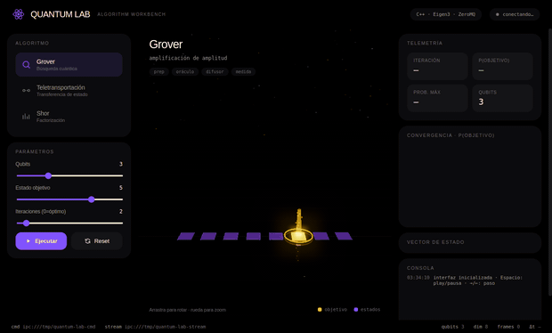
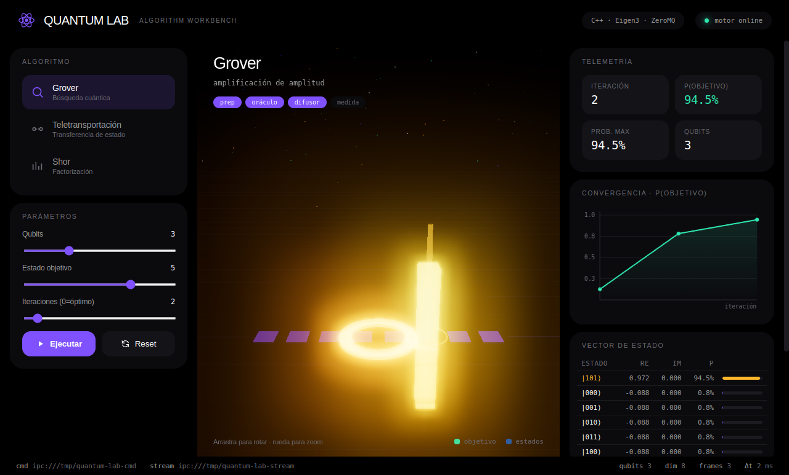
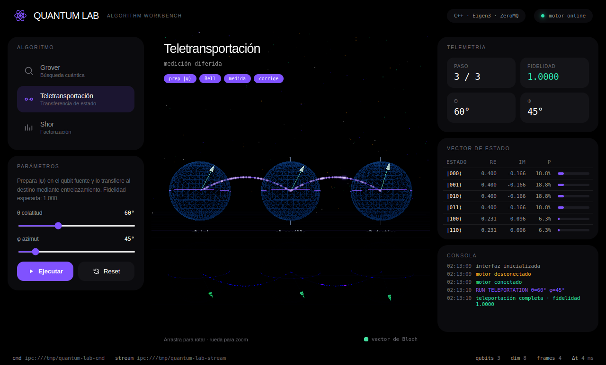
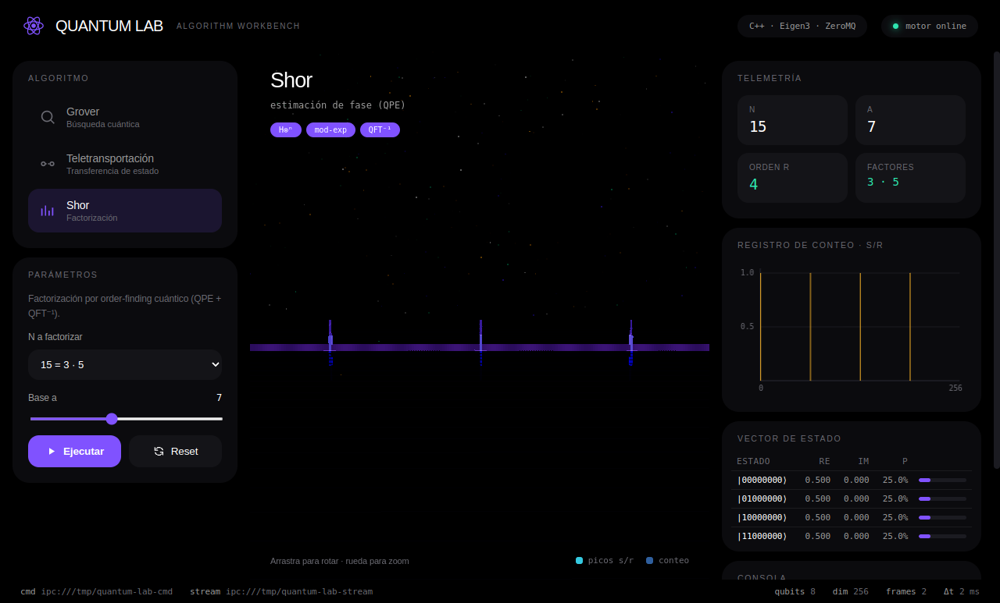

<div align="center">

# ⚛️ Quantum Lab

**Laboratorio cuántico interactivo** — traduce algoritmos cuánticos (Grover, Teletransportación, Shor) en visualizaciones 3D inmersivas, con rigor técnico total.

[](https://github.com/C0z1/quantum-lab/actions/workflows/ci.yml)
[](https://github.com/C0z1/quantum-lab/actions/workflows/release.yml)
[](https://github.com/C0z1/quantum-lab/releases)
[](LICENSE)

C++20 · Eigen3 · ZeroMQ  |  Python · Qiskit  |  Electron · Three.js



</div>

## ⬇️ Descargar (preview v1.0)

El instalador de Windows se genera automáticamente en cada release:

**→ [Releases](https://github.com/C0z1/quantum-lab/releases) → `QuantumLab-Setup-1.0.0.exe`**

> Preview inicial. La factorización de Shor y la validación con Qiskit son parte de las herramientas de desarrollo; el instalador incluye el motor C++ y la app.

## ✨ Características

- **Tres algoritmos** con visualización dedicada:
  - **Grover** — columnas de energía de probabilidad + curva de convergencia + ondas de choque por iteración.
  - **Teletransportación** — esferas de Bloch + canal de entrelazamiento con partículas + explosión al completar (fidelidad 1.000).
  - **Shor** — factorización por estimación de fase (QPE); picos s/r del registro de conteo.
- **Reproducción interactiva**: play/pausa, **paso a paso**, línea de tiempo con scrubbing y velocidad (0.5×–4×). Atajos: `Espacio`, `←`/`→`, `R`.
- **Interfaz** de nivel workbench: telemetría en vivo, vector de estado, consola de eventos, campo de partículas y bloom.
- **Motor C++** riguroso (Eigen3) que escala hasta 20 qubits, comunicado por **ZeroMQ + MessagePack**.
- **Validación cruzada C++ ↔ Qiskit** a precisión de máquina.

## 🖼️ Capturas

| Grover | Teletransportación | Shor |
|---|---|---|
|  |  |  |

## 🏗️ Arquitectura

Tres procesos independientes comunicados por ZeroMQ (sin N-API en la ruta crítica):

```
[Renderer]            [Main (Electron)]        [C++ Engine]           [Python/Qiskit]
Three.js / UI  ←IPC→  ipcMain + QuantumBridge  ←ZMQ REQ/REP──→  motor (cómputo)
(60fps)               (REQ + SUB)              ←ZMQ PUB/SUB──→  frames statevec
                            └── subprocess ─────────────────────→ validación (opcional)
```

- **cmd** `tcp://127.0.0.1:5770` (REQ/REP, ACK inmediato)
- **stream** `tcp://127.0.0.1:5771` (PUB/SUB, frames MessagePack `[re,im,prob,…]`)

Detalle en [`docs/architecture.md`](docs/architecture.md) · glosario en [`docs/quantum-concepts.md`](docs/quantum-concepts.md).

## 🔧 Compilar desde el código

### Windows
El instalador nativo se compila en CI (GitHub Actions, runner Windows + vcpkg + MSVC). Para reproducirlo localmente necesitas Visual Studio 2022 Build Tools, [vcpkg](https://github.com/microsoft/vcpkg) y Node 18+; el flujo está en [`.github/workflows/release.yml`](.github/workflows/release.yml). Para desarrollo, **WSL2 (Ubuntu)** es lo más simple — sigue los pasos de Linux.

### Linux / WSL2
```bash
./scripts/bootstrap.sh   # instala dependencias del sistema y compila todo
./scripts/dev.sh         # lanza motor C++ + Python + Electron
```

### macOS
```bash
brew install cmake eigen zeromq cppzmq msgpack-cxx nlohmann-json googletest python@3.11 node
./scripts/build-all.sh && ./scripts/dev.sh
```

## ✅ Verificación

```bash
cd packages/core-engine/build && ctest --output-on-failure   # 25/25 tests C++
cd packages/qiskit-bridge && pytest tests/ -v                # 14/14 tests Qiskit
python3 scripts/validate.py                                  # C++ ↔ Qiskit  (max|Δp| ≈ 1e-14)
```

| Golden value (Grover) | n | target | iters | P(target) |
|---|---|---|---|---|
| | 2 | 3 | 1 | 1.000 |
| | 3 | 5 | 2 | 0.945 |
| | 4 | 7 | 3 | 0.961 |

## 📄 Licencia

MIT — ver [LICENSE](LICENSE).
